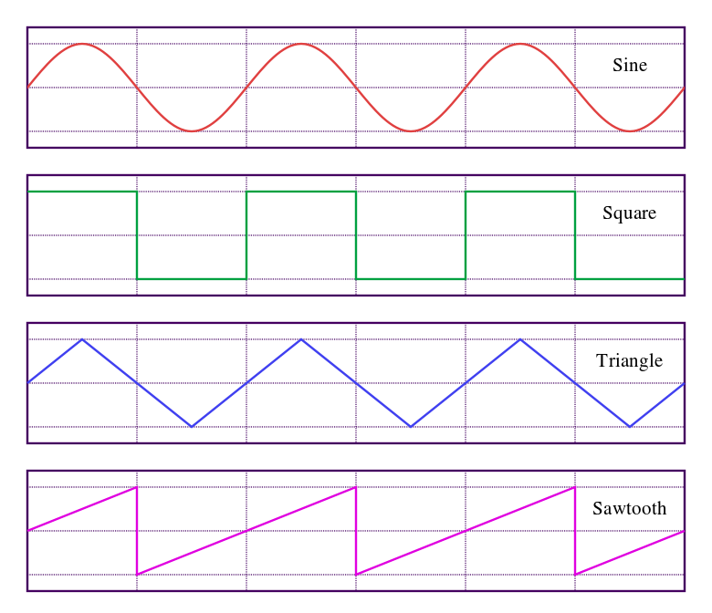
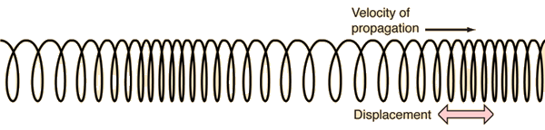
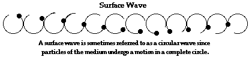
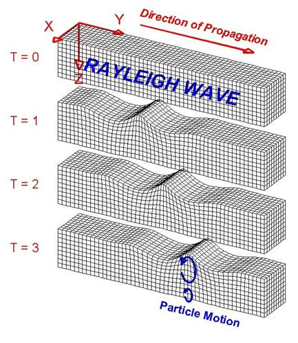

footer: the pink mirror, 2016-09-21
slidenumbers: true

# the electromagnetic spectrum

doug goodwin, 2016-09-21

---

# imagine a spectrum that includes sound, light, radio and X-rays. 

---

---

## this is a little deceiving because sound, radio, light and X-rays are not all the same thing. We can say that they are energy that travel as waveforms. 

## what are waveforms?

---

# waveforms

https://en.wikipedia.org/wiki/Waveform

---

---

# what do they sound like?

---

# those characteristics are caused by the shape of the waveform. there are also different kinds of waves.

---

1. transverse waves
2. torsional waves
2. longitudinal / compression / pressure waves
3. surface waves

---

# question
What is the relationship between the particle movement and the direction of energy transport?

---

# 1. transverse wave

---

# 2. torsional wave

---

# 3. longitudinal / pressure wave

---

# 4. surface wave

---

---

# earthquake / seismic waves

Earthquakes generate three types of seismic waves: 

1. P (primary) waves
2. S (secondary) waves
3. surface waves

---

# P (primary) waves

 - longitudinal
 - first to arrive
 - move at 1500 to 1800 m/sec (3300-4000 mph!)
 - may travel through the Earth's core

---

# S (shear) waves

 - 1.7 times slower than P waves
 - shake the ground perpendicular to the direction in which they are propagating
 - do not travel through liquid

---

# surface waves

responsible for most of the damage

1. Love waves
2. Rayleigh waves

---

Love waves: side to side

---

Rayleigh waves: up and down

