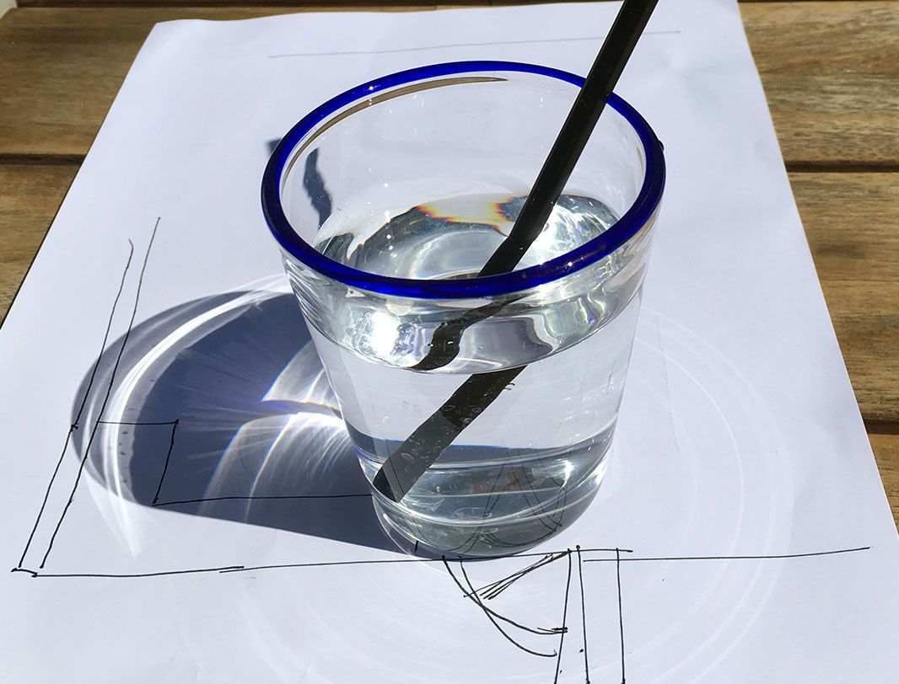

footer: the pink mirror | douglas goodwin 2016
slidenumbers: true

# PINK MIRROR | Direct and Indirect Realism
dgoodwin september 28, 2016

---

# direct realism

what do you see?

---

^ 

---

but wait, what about this?

---

---

# what would indirect realism look like?
Fritz Kahn, Man Machine/Maschine Mensch.

---

---

^ 

^ Fritz Kahn: Man Machine/Maschine Mensch, edited by Uta von Debschitz and Thilo von Debschitz (Springer Verlag GMBH, 2009).

---

# more!

---

^ 

---

# so, maybe more like this?

---

---

# argument from illusion

 Ayer, A.J., The Foundations of Empirical Knowledge. New York: Macmillan, 1940.

---

## I have a stick, which appears to me to be straight, but when I hold it underwater it seems to bend and distort.

---

## I know that the stick is straight and that its apparent flexibility is a result of its being seen through the water, yet I cannot change the mental image I have of the stick as being bent.

---

# This mental representation -- this illusion -- tells us nothing about the stick's true properties. They remain inaccessible.

