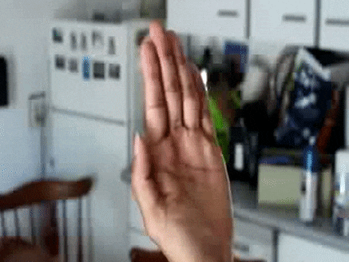
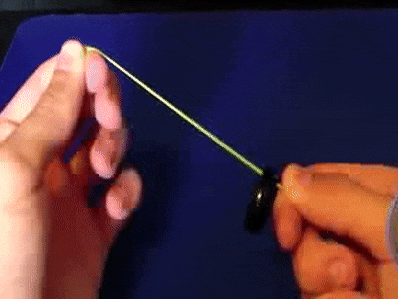

# Lab: Perform a magic trick

>Someone who knows how to manipulate and control the information available to an observer for perceiving events can make [an observer] perceive such an impossibility.... The magician does so by suppressing...information for what really happened or by preventing the observer from picking it up.

Edward Tufte, from Visual Explanations, http://www.nyu.edu/classes/bkg/methods/Tufte_magic.pdf

The goal of this lab is to learn a simple magic trick and practice it in front of your partner. Perform the tricks for one another and help your partner strengthen the illusion. 

##Step 1: choose a trick

It needs to be easy! I selected one from TheDanocracy's "7 MORE Simple Magic Tricks With Household Items" on youtube and another from Easy Magic Tricks for Kids on About.com. 

1. Disappearing Finger

[video documentation](https://youtu.be/esVZxjLrwH0?t=41s)

There are several ways to do this trick. Watch the video for one approach!

2. Rising Ring

[video documentation](https://youtu.be/V3NljG-mpBg?t=49s)

To perform the trick, pull the band taut and rotate it at a slight incline, making sure that the ring is resting on the lower part of the band. Pull the band taut and slowly release the extra band that’s in your left hand. The rubberband will creep out and carry the ring with it, making it look as if the ring is rising. In reality, it’s the band that’s slowly moving.

## Step 2: Practice

Practice the trick for your partner. Watch critically then discuss how the trick might be improved. 

## Step 3: Perform, Record!

Use your camera/phone to take pictures of the trick. Email the pics to dgoodwin@calarts.edu.