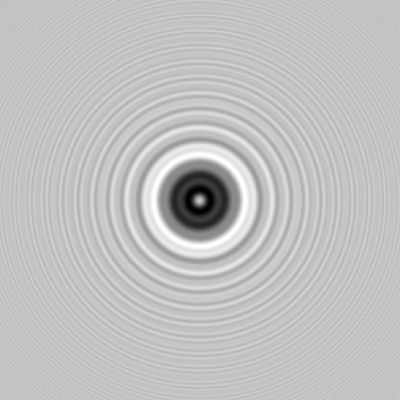

# DEBATE : Newton vs. Huygens. 

Here are some notes for our next debate. 

## OVERVIEW: Is light a particle or a wave?

Newton (1643 - 1727) believed that light is made up of tiny corpuscles, or particles. Christian Huygens (1629-1695) argued that Newton was wrong on this count. Young Huygens worked out some physics (using Newton's' tools) to back up his claims that light was a wave. So began the first comprehensive theory of light.

Huygens proposed that light travels as a wave, like sound. He predicted that light waves would interfere in ways that would produce visible effects. This point was demonstrable, but his theory could not account for all things. Huygens was challenging one of the most brilliant (and caustic) characters of all time. Isaac Newton was not an easy man to debate and the corpuscular theory neatly accounts for reflection. Newton made the theory explain refraction through a lens, and demostrated splitting of sunlight into a rainbow with a prism. This last case is not explainable with particule theory, but Newton's particle theory went unchallenged for over a century.

## NEWTON: Light is a Particle

Newton did have several pieces of evidence that light was a particle:

1. Light travels in straight lines. If light is a particle then it will not be able to diffract after going through an opening or around an obstacle. Particles always move in straight lines, and light seems to move in straight lines. (N.B. This is not the same as refraction, which is when a particle or wave changes direction after going from one medium to another medium.)

2. Light can travel through a vacuum. In Newton's time, the only waves that anybody really knew much about were mechanical waves, which need a substance (a medium) to move through (e.g. sound travels through air). Since they also had a pretty good idea in Newton's time that the space between the earth and the sun was a vacuum, how could light reach earth if it was a wave? If light is a particle it would have no trouble moving through a vacuum.

3. Light consists of of colored light (corpuscles of different sizes) that get separated in a prism or generally in glass

## HUYGENS: Light is a Wave

Huygens had a tough job, since not only does he have to disprove Newton’s two main points, he also has to overcome the power that Newton has in the world of science. He focused most of his attack on the first point outlined above.

If he could show that light would diffract when it passed through openings or around obstacles, it would prove that light was behaving like a wave. He looked at the work of Francesco Grimaldi, who had shown the edges of shadows are not perfectly sharp. If light was a particle they should be.

If light is a wave, we can explain that fuzziness as the diffraction of the waves partly around the object.

The Poisson Spot is evidence that light was able to diffract around obstacles.

He said we should imagine the crest of a wave as being made up of an infinite number of tiny waves, which he called wavelets. As these wavelets pass through an opening or an obstacle they will begin to spread out again, and this leads to diffraction.

Color comes from different wavelengths of light, not differently sized particles (this idea actually comes much later, but you can cheat a little if you can support this proposition)

## references

http://en.wikipedia.org/wiki/Wave%E2%80%93particle_duality
http://en.wikipedia.org/wiki/Arago_spot
https://youtu.be/LJtLrfKdG3A

---

## TOPIC TEAMS

1A. TEAM HUYGENS, AFFIRMATIVE: Light is made up of microscopic waves. This can be demonstrated by 

1N. TEAM NEWTON, NEGATIVE: Wrong -- If light were a wave does not adequately explain how light travels without a medium (ie through a vacuum). Nor does it explain how light rays do not interfere with one another.

2N. TEAM HUYGENS, NEGATIVE: Your critique is too narrow. Light is a special substance and it may travel through an equally obscure medium. 

2A. TEAM NEWTON, AFFIRMATIVE: We see evidence for particles of light in reflection. The corpuscles (think photons) recoil from reflective surfaces precisely as do other bodies. 

## PROCEDURE

Research the issue together and come up with lists of examples to support your topic and position. Prepare logical arguments. You may not subscribe to the view you have been assigned. You don’t need to believe in a cause to argue for (or against) that cause.

Everyone isexpected to participate in the research and strategy of the debate. Decide who who will do most of the talking during the debate and support your team with examples and other support.

## SCHEDULE

1A: two minutes, present case.
1N: two minutes, present case.
Two minute break to prepare rebuttals and summaries
1N: two minutes, rebuttal. Defend opposing arguments and defeat supporting arguments without adding new information.
1A: two minutes, rebuttal and summary.

2A: two minutes, present case.
2N: two minutes, present case.
Two minute break to prepare rebuttals and summaries
2N: two minutes, rebuttal and summary. Defend opposing arguments and defeat supporting arguments without adding new information.
2A: two minutes, rebuttal and summary.

## DISCUSSION

Present your judgements. the winner is the one who has presented the strongest case. Ask yourself:

who communicated clearly?
who refuted the opponent’s arguments best?
