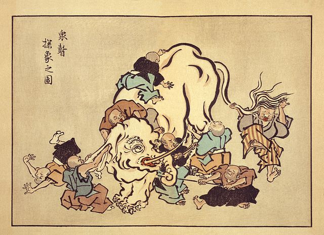

# PINKMIROR | From Berkeley's idealism to content via sense data

We have articulated ideas about the reality of perceived objects. Now let's consider the other side of the relationship: how a sense-data collected into content? Can we talk about the objects that gather in our minds? Let's try a famous example of several blind men meeting an elephant. 

> Blind monks examining an elephant, an ukiyo-e print by Hanabusa Itchō (1652–1724).

>  'The King sent for seven blind men who had seen an elephant. He asked each one of them in turn, "What sort of thing is an elephant?" They answered:

 - the blind man who felt the elephant's head said that an elephant is like a large clay pot
 - one who felt the ear said that it's like a basket
 - the one who felt the tusk said that an elephant is like a plow blade
 - the one who felt the tip of the tail said that an elephant is like a brush

What can you say about that?

1. Are they wrong?
2. what are they missing?
3. why is the King doing this?
2. can you talk about this conceptually?

## Let's try another model of failed concept: Cargo Cults. 

