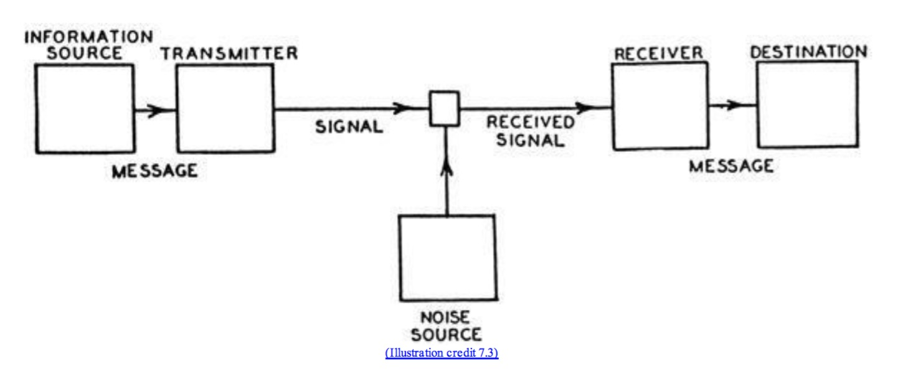

# demonstrating shannon's mathematical theory of communication

## experiment

**materials**

1. a paragraph of text
2. a reader
3. a noise source
4. a receiver
5. a destination

have a volunteer read the text to a receiver. gradually increase the amount of noise until the receiver is unable to understand the text. 