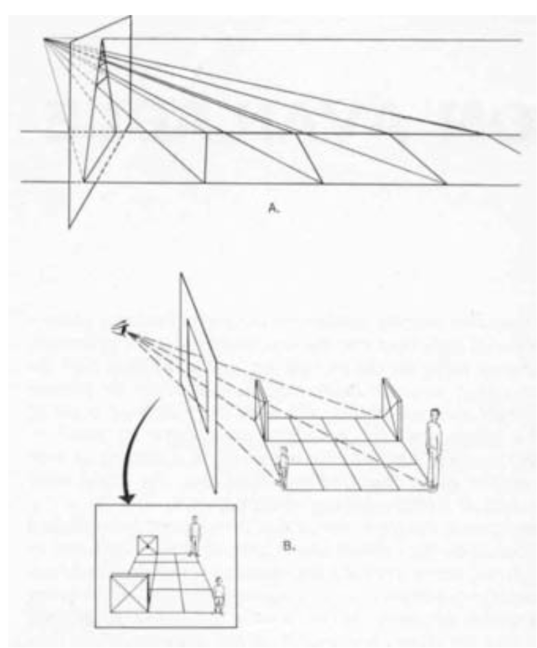
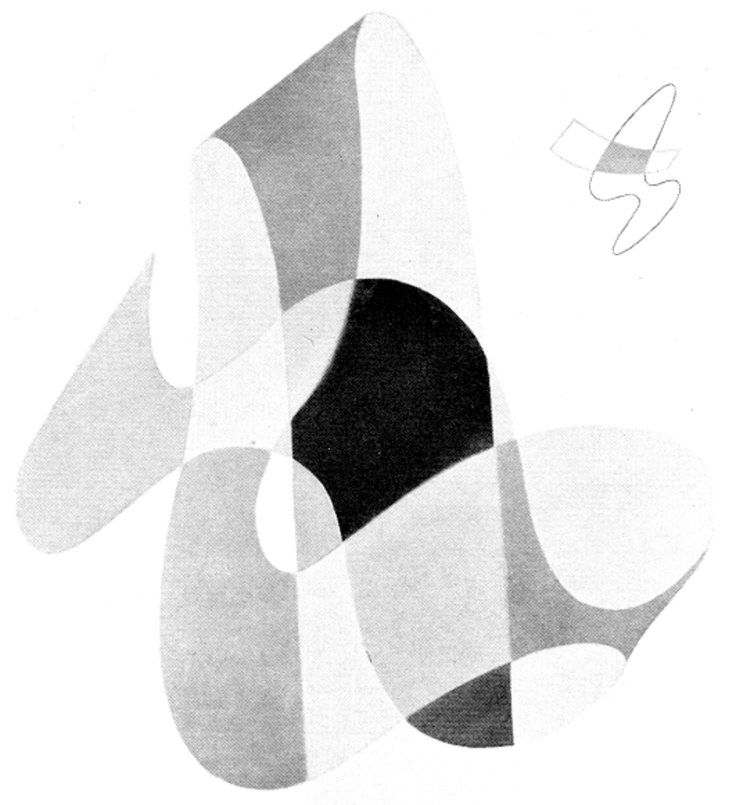

# Lecture: The Information Available in Pictures

doug goodwin, 26 october 2016

---

# "The Information Available in Pictures"
## James Gibson

Leonardo Magazine, 1971

---

# Abstract: 3 theories of what a picture is

1. a pictures reproduces a **sheaf of light rays** coming to a perceiver. each ray corresponds to a spot of color arranged on a picture's surface. the representation succeeds with the correspondences of spots to light rays
2. a picture is a **set of symbols**, like words, that the perceiver must learn to read
3. pictures are neither of these, rather they are displays of **optical information**

---

# 1. a sheaf of light rays

---

# 2. symbols

---

continues...

> If one sees two or more figures partly overlapping one another, and each of them claims for itself the common overlapped part, then one is confronted with a contradiction of spatial dimensions. To resolve this contradiction, one must assume the presence of a new optical quality. The figures are endowed with transparency; that is they are able to interpenetrate without an optical destruction of each other. 

---

continues...

> Transparency however implies more than an optical characteristic; it implies a broader spatial order. Transparency means a simultaneous perception of different spatial locations. Space not only recedes but fluctuates in a continuous activity. The position of the transparent figures has equivocal meaning as one sees each figure now as the closer, now as the further one.[^1]

[^1]: "Study of Transparency" by Clifford Eitel. Quote from "Language of Vision," p.77, Gyorgy Kepes.

---

# 3. information, again 

what is the picture signal like?

---

# gibson's invariants

> the world contains "invariant" information that was directly accessible to the perceptual systems of humans and animals which are attuned to pick up this information through *direct perception*.

---

continues...

> The perceptual system actively seeks invariants in the environment, invariants under changes in illumination, successive sampling of the optic array, transformations due to movement of the observer, or local transformations due to movement or change in objects

---

# the invariants

## non-change that persists during change

1. sky above, earth below
3. straight lines
4. points
5. continuity
6. behavioral cues
7. proportions
8. ratios of light intensity
9. fire is packaged with warmth, light, odor, and sound
3. gravity
4. the four angles in a rectangle
4. you can see your nose
5. shadows have penumbrae

---

1. Pictures re-present the sheaf of light rays the eye would intercept if you were standing in the right place looking at the real world version of the scene in the picture. This then simply triggers the same chain of information processing events ending in the same percept. This is based in standard projective geometry and the idea that vision begins with a retinal image. Besides being an incorrect analysis of vision, this definition of how a picture informs us about its subject fails to explain anything other than photographs or realistic paintings. Line drawings and (especially) caricatures cannot be explained using these tools. Pictures therefore do not inform us about their subject by presenting identical sensations as their subject.
2. Pictures, like language, are symbol systems. Art is not constrained to projective geometry but instead develops new 'languages' with which to express concepts and the observer must learn to 'read' these in order to be informed by the picture about it's subject. Gibson suggests that the only conventional elements to picture perception are the 'rules' for observing it in order to be convinced it's real (monocular vision, no slant on the image, etc; 'aperture' viewing, in effect), and that everything else about viewing a picture is just an instance of visual perception and will follow the same rules.

The issue of specification comes from Gibson's (1966, 1979) analysis of visual perception, so that's where I'll start too. Most descriptions of visual perception begin with the anatomy of the eye; people note that the eye resembles a camera, and that the lens seems to focus a messy, upside down image onto the retina. The retina then pixelates that image into neural activity, and this pixelated structure then shows up in primary visual cortex (this is topographic mapping). If vision does indeed begin this way, then a huge amount of work seems to be required to take this impoverished stimulus and use it as the basis for the rich, 3D visual world we experience.

Gibson's ecological theory begins with a re-evaluation of the stimulus for vision. The first three chapters of the 1979 book are about the world and what it contains, while chapter 4 is about how this world can interact with light to produce information. Only once he lays out the information available to the organism does he begin to talk about the act of perception itself; this re-evaluation of the 'job description' for a visual system is one of his most important contributions to psychology. Gibson's reanalysis leads him to conclude that action relevant properties of the world (specifically, affordances) can be specified in the optic array, and this concept underpins the directness of his theory of perception.
